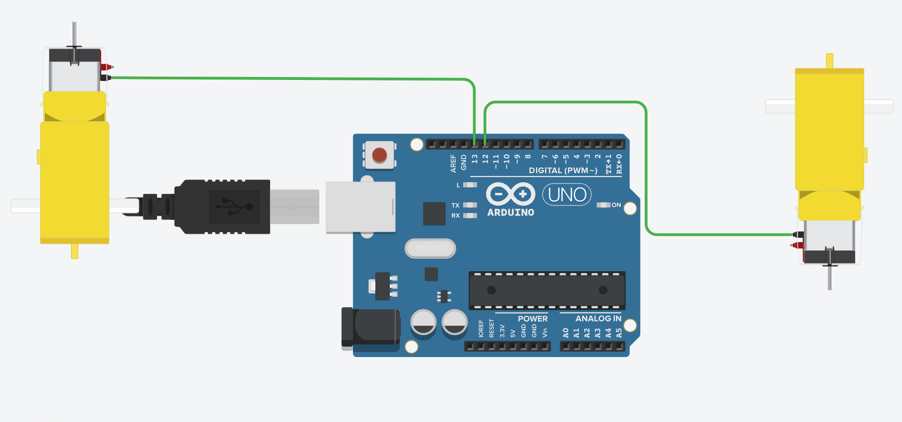

# EARL

Father son project to create an autonomous robot vehicle that can carry cargo in a straight line and avoid obstacles.

## Objectives

An automous vehicle that can:

[ ] Drive straight line

[ ] Avoid obstacles in its path

[ ] Carry cargo from a spefic spot to a destination in straight line.

## Hardware

For this project the following hardware was selected:

- An Arduino Uno micro-processor. This allowed a small, cost-effective processor that is lightweight and is used to process the proximity sensor input and to control the motors that drive the robot based on logic. 
- A Duinotech 4WD Motor Classic Kit. This kit provides a system of 4 motors and wheels on a perspex chasis with a perpex cover plat that allows placing small cargo on.
- Proximity sensor. The proximit sensor allows the robot to detect if any obstacles are in its way and the distance they are away from the robot.
  
## Research

I made a simple mockup of the robot in tinkercad and programed it to rotate both wheels in the same direction. There were 2 motors that drove the wheels one was connected to pin 13 the other to pin 12 with some basic code to move them.

## Code

- the code for the test is bellow

## Development Environment

To develop the code and have it upload to EARL and to debug that code the following development environment is needed.

### Devlopment Computer

A fairly modern computer with at least 8GB of RAM, 256MB of available hard drive space and USB-C or USB-A ports is needed. Both a Mac OS (Catalina or later) and Windows (10 or Later) can be used for development.

Arduino IDE is the only softwra needed for development.

To upload sketches (code) to the Arduino board, the development machine needs to have a cable that converts from USB-A or USBC-C (depending on what ports the machine has) to USB-B (this is the only port type the Arduino Uno board has).

All code is written Arduino compliant C++.
___
